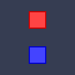

# Falling Blocks

<div align="center">



**A simple yet addictive falling blocks arcade game built with Godot 4**

Dodge the falling blocks, survive as long as you can, and beat your high score!

[](https://godotengine.org/)
[](LICENSE)

</div>

## 🎮 About

Falling Blocks is a classic arcade-style game where you control a blue square trying to avoid an endless stream of red falling blocks. The game progressively gets harder as you survive longer, with blocks falling faster and spawning more frequently.

### Features

- ✨ **Simple but engaging gameplay** - Easy to learn, hard to master
- 📈 **Progressive difficulty** - Game gets harder the longer you survive
- 🏆 **Score tracking** - Earn points and beat your high score
- ⏱️ **Survival timer** - Track how long you've lasted
- 🎨 **Clean, minimalist design** - Focus on gameplay
- 💾 **Persistent high scores** - Your best score is saved automatically
- ⏸️ **Pause functionality** - Take a break when needed
- 🔄 **Quick restart** - Jump back in instantly after game over

## 🎯 How to Play

### Controls

| Action | Keys |
|--------|------|
| Move Left | ← Arrow or A |
| Move Right | → Arrow or D |
| Pause | P or ESC |
| Restart | R (after game over) |
| Start Game | Space or Enter |

### Objective

- Dodge falling red blocks by moving left and right
- Survive as long as possible to increase your score
- Each block that passes you safely awards points
- Collision with any block ends the game
- The game gets progressively harder with:
  - Faster falling blocks
  - More frequent spawns
  - Higher difficulty levels every 10 seconds

## 🚀 Getting Started

### Prerequisites

- [Godot Engine 4.3+](https://godotengine.org/download) installed on your system

### Installation

1. **Clone the repository**
   ```bash
   git clone https://github.com/codeforgood-org/godot-falling-blocks.git
   cd godot-falling-blocks
   ```

2. **Open in Godot**
   - Launch Godot Engine
   - Click "Import"
   - Navigate to the cloned directory
   - Select the `project.godot` file
   - Click "Import & Edit"

3. **Run the game**
   - Press F5 or click the "Run Project" button in Godot
   - Alternatively, run from command line:
     ```bash
     godot --path . scenes/main/main.tscn
     ```

### Building for Distribution

#### Desktop (Windows, Linux, macOS)

1. Open the project in Godot
2. Go to **Project → Export**
3. Add export presets for your target platforms
4. Click "Export All" or export individually

#### Web (HTML5)

1. Go to **Project → Export**
2. Add an HTML5 export preset
3. Export to a directory
4. Host the exported files on a web server

## 📁 Project Structure

```
godot-falling-blocks/
├── assets/              # Game assets
│   ├── fonts/          # Font files
│   ├── sounds/         # Audio files (SFX, music)
│   ├── sprites/        # Image and sprite files
│   └── themes/         # UI themes
├── scenes/             # Godot scene files
│   ├── block/         # Falling block scene
│   ├── effects/       # Visual effects (particles)
│   ├── main/          # Main game scene
│   ├── player/        # Player character scene
│   └── ui/            # UI scenes (menus, HUD)
├── scripts/           # GDScript files
│   ├── block.gd
│   ├── collision_particles.gd
│   ├── game_manager.gd
│   ├── game_over_screen.gd
│   ├── hud.gd
│   ├── main.gd
│   ├── pause_menu.gd
│   ├── player.gd
│   └── start_menu.gd
├── .editorconfig      # Code style configuration
├── .gitignore         # Git ignore rules
├── CHANGELOG.md       # Version history
├── CONTRIBUTING.md    # Contribution guidelines
├── icon.svg           # Project icon
├── LICENSE            # MIT License
├── project.godot      # Godot project configuration
└── README.md          # This file
```

## 🎨 Game Architecture

### Core Systems

1. **Main Game Controller** (`main.gd`)
   - Manages game state (menu, playing, game over, paused)
   - Handles spawning and difficulty scaling
   - Coordinates between all systems

2. **Player System** (`player.gd`)
   - Input handling
   - Movement and boundary constraints
   - Collision detection

3. **Block System** (`block.gd`)
   - Falling behavior
   - Difficulty scaling
   - Auto-cleanup when off-screen

4. **UI System**
   - Start menu with instructions
   - HUD showing score, time, level
   - Game over screen with stats
   - Pause overlay

5. **Score & Difficulty**
   - Points awarded for dodging blocks
   - Difficulty increases every 10 seconds
   - Progressive speed and spawn rate scaling
   - Persistent high score tracking

## 🛠️ Development

### Coding Standards

This project follows the [Godot GDScript style guide](https://docs.godotengine.org/en/stable/tutorials/scripting/gdscript/gdscript_styleguide.html).

Key conventions:
- Use snake_case for functions and variables
- Use PascalCase for class names
- Document functions with docstrings
- Keep functions small and focused
- Use type hints where possible

### Adding New Features

1. Create a new branch for your feature
2. Implement your changes following the coding standards
3. Test thoroughly in the Godot editor
4. Submit a pull request with a clear description

See [CONTRIBUTING.md](CONTRIBUTING.md) for detailed guidelines.

## 🐛 Known Issues & Future Improvements

### Planned Features

- [ ] Sound effects and background music
- [ ] Power-ups (slow motion, shield, etc.)
- [ ] Different block types and patterns
- [ ] Visual effects and screen shake
- [ ] Leaderboard system
- [ ] Multiple difficulty modes
- [ ] Custom skins and themes
- [ ] Mobile touch controls
- [ ] Gamepad support

### Known Issues

- None currently reported

Found a bug? Please [open an issue](https://github.com/codeforgood-org/godot-falling-blocks/issues)!

## 📊 Performance

- **Target FPS:** 60
- **Minimum System Requirements:**
  - OS: Windows 7+, macOS 10.12+, Linux (any modern distro)
  - RAM: 1 GB
  - Graphics: OpenGL 3.3 compatible

## 🤝 Contributing

Contributions are welcome! Whether it's:

- 🐛 Bug fixes
- ✨ New features
- 📝 Documentation improvements
- 🎨 Art and audio assets
- 🌍 Translations

Please read [CONTRIBUTING.md](CONTRIBUTING.md) for details on our code of conduct and the process for submitting pull requests.

## 📝 License

This project is licensed under the MIT License - see the [LICENSE](LICENSE) file for details.

## 👏 Acknowledgments

- Built with [Godot Engine](https://godotengine.org/)
- Created by [Dang Linh Anh](https://github.com/codeforgood-org)
- Inspired by classic arcade falling block games

## 📧 Contact

- **GitHub Issues:** [Report bugs or request features](https://github.com/codeforgood-org/godot-falling-blocks/issues)
- **Discussions:** [Join the conversation](https://github.com/codeforgood-org/godot-falling-blocks/discussions)

---

<div align="center">

**Made with ❤️ using Godot Engine**

[Play Now](#-getting-started) • [Report Bug](https://github.com/codeforgood-org/godot-falling-blocks/issues) • [Request Feature](https://github.com/codeforgood-org/godot-falling-blocks/issues)

</div>
